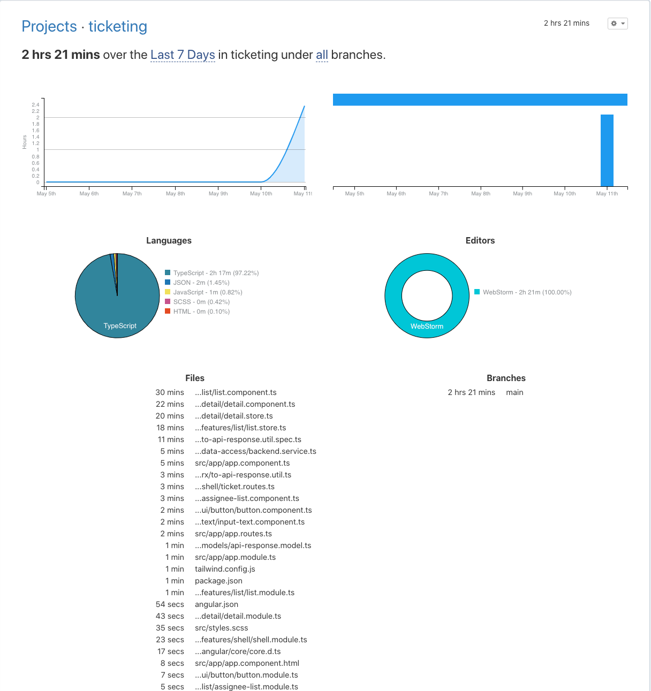

# Ticketing

This project was generated with [Angular CLI](https://github.com/angular/angular-cli) version 12.0.0-rc.3.

This project showcases a simple Ticketing system where user can filter, add, assign, and complete tickets

## State Management

This project uses [Component Store](https://ngrx.io/guide/component-store) as a lightweight state management system.
**Ticketing** has two pages: Ticket List and Ticket Detail. Each page has their own **Component Store** to manage the
state of that page as well as handling side effects that the page might have.

## UI

**Ticketing** uses [TailwindCSS](https://tailwindcss.com) for quick prototyping with utility classes. Some styles were
referenced from [TailwindCSS Components](https://tailwindcomponents.com/) which is a free repository of
community-submitted components.

## Timeline

Time spent on this project is kept track with [Waka Time](https://wakatime.com).

The bulk of the time is spent on the pages (List and Detail), and their **Component Store**.
